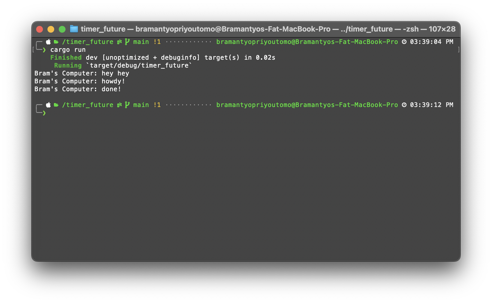
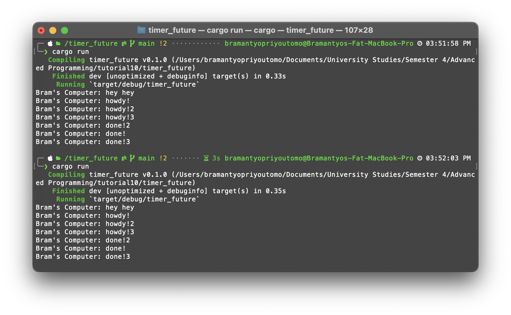

# Tutorial 10 - Async Programming

### 1.2: Understanding how it works

- The output demonstrates how asynchronous programming allows concurrent execution of tasks without blocking the main thread, improving the responsiveness and efficiency of the program.

### 1.3: Multiple Spawn and removing drop

- Adding more spawner.spawn calls increases the number of asynchronous tasks spawned by the executor.
- However, by including drop(spawner) after all tasks are spawned, executor is signaled that no more tasks will be added. This allows the executor to run until all tasks complete, and then the program terminates.
- But when drop(spawner) is omitted, the executor is not notified that no more tasks will be added. As a result, it continues running indefinitely, waiting for potential new tasks.
